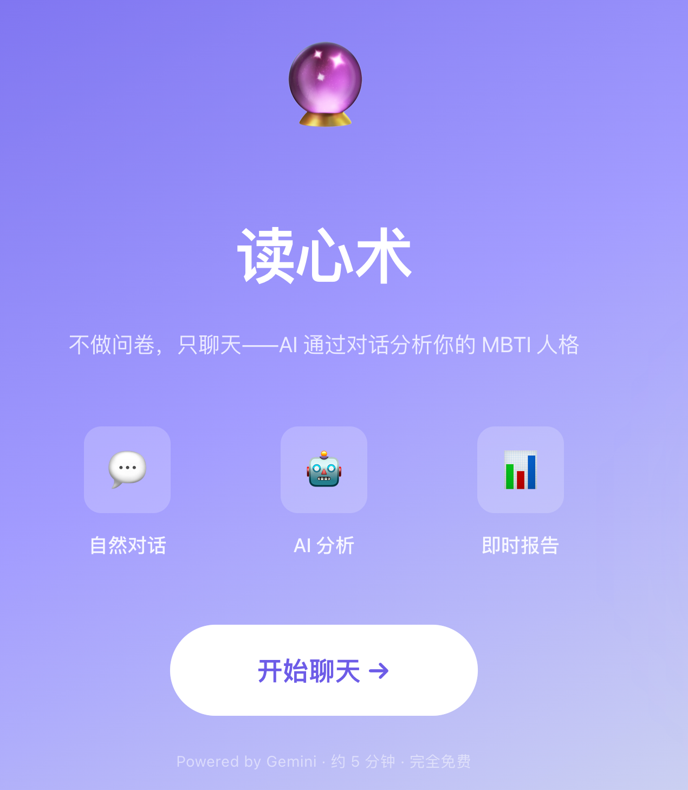
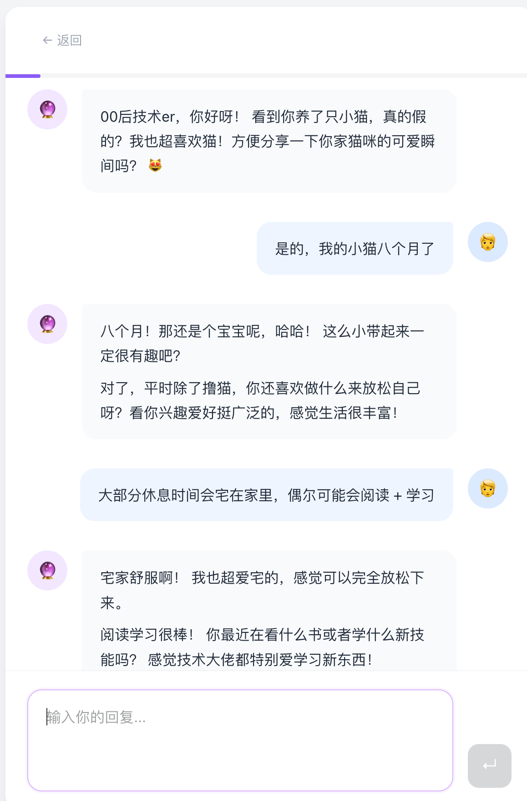
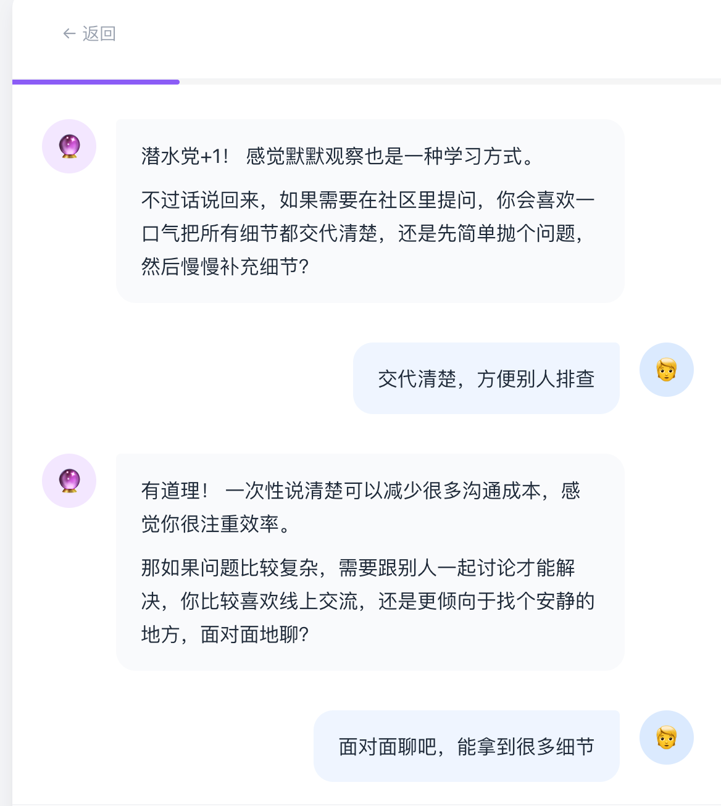
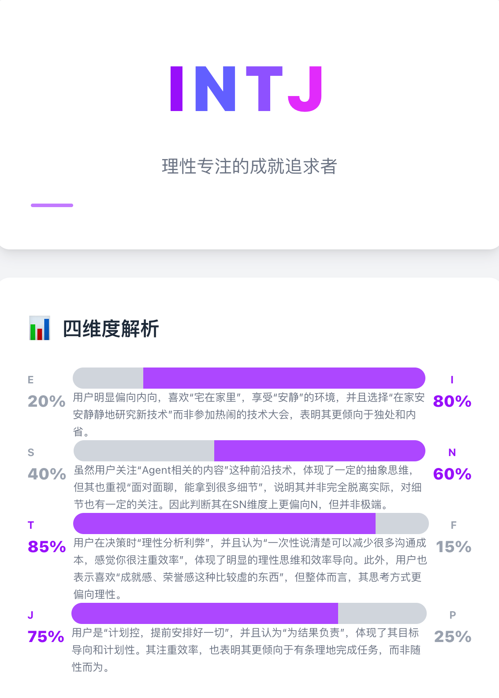
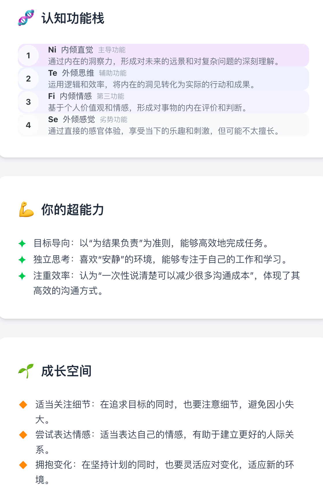

# talk-mbti

[English](./README_EN.md)

**没有一道选择题的 MBTI 测试。打开就是聊天，通过对话测出你的人格类型。**

动辄 90+ 题的 MBTI 问卷，大部分人做到中间就开始机械点击了。

心理学里把这叫**社会期许偏差（Social Desirability Bias）**，人在填问卷时会无意识地美化自己，选那个更好的自己而不是真实的自己。选择题测的不是你是什么样的人，而是你希望自己是什么样的人。

talk-mbti 换了一个思路：跟你聊天。聊什么都行，工作、兴趣、最近的烦恼、上周做的一个决定。AI 从你的措辞、你的第一反应、你做选择时的底层逻辑里提取真实的行为信号。聊完直接出报告，四个维度的倾向百分比、认知功能栈、超能力和成长盲区，全都有。

**👉 在线体验：https://mbti.charles-cheng.com**

<table>
  <tr>
    <td></td>
    <td></td>
    <td></td>
    <td></td>
    <td></td>
  </tr>
</table>

## License

[MIT](./LICENSE)
